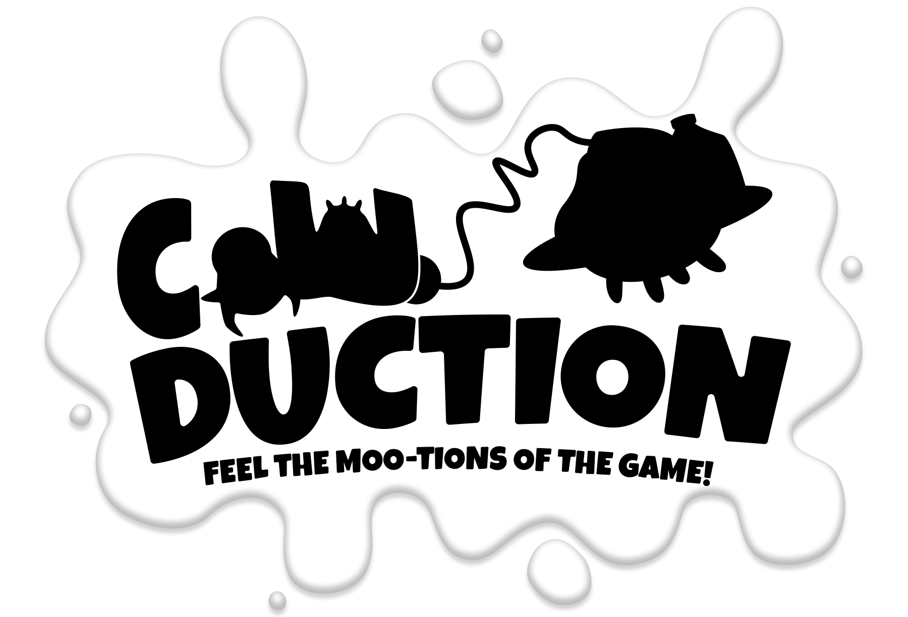
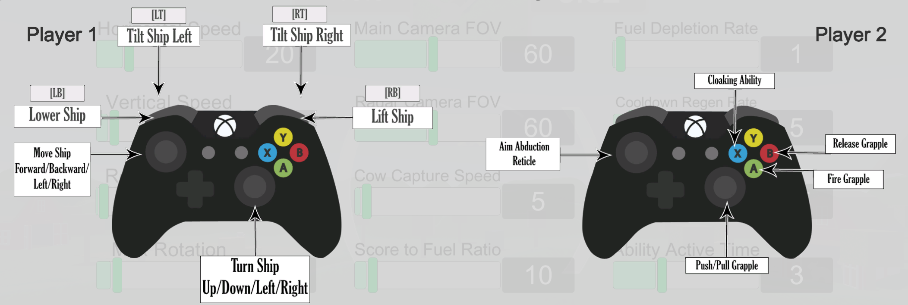

<p align="center">
  
</p>

# Cow-Duction

Cow-Duction is a wacky, cartoonish, and interactive theme park attraction for multiple players. Two people experience the game inside a motion simulator, cooperatively piloting an alien spaceship to abduct dairy cows in a 3D environment. People waiting in line can use mobile devices to defend the cows from the dairy-deficient aliens. This attraction creates a unique, asymmetrical player-versus-player experience that’s fast-paced fun for everyone!

# Area 52%

We're a team of 10 students (+ 6 freelancers) at Drexel University, tasked with building a game for the [Voyager motion platform](https://vimeo.com/mosimlab) in Game Development: Workshop II. 

View our full team roster [here](https://www.area52p.com/team).

## How to Play Cow-Duction

Although the game is meant to be played on a motion platform with Xbox controllers, there are options for playing a desktop or browser version with a mouse and keyboard.

### Check the Latest Release

Releases will be published [here](https://github.com/kadeo13/Area52Percent/releases).
The latest WebGL build is also available on [our website](https://www.area52p.com/play).

### Get Familiar With the Controls

<details>
  <summary> Xbox 360 Controllers </summary>
  <p align="center">
    
  </p>
</details>

<details>
  <summary> Keyboard/Mouse </summary>

* `W` Move forward
* `A` Move left
* `S` Move backward
* `D` Move right

* `Z` Move upward
* `C` Move downward
  
* `UpArrow`    Turn camera upward
* `LeftArrow`  Turn camera left
* `DownArrow`  Turn camera downward
* `RightArrow` Turn camera right
  
* `Q`          Roll camera left
* `E`          Roll camera right
  
* `F` Activate cloak ability
  
* `Mouse`  Control reticle on screen
* `Mouse0` Shoot grappling hook
  
* `Space`  Release cow or farmer (if grappled)
* `V`      Pull cow (if grappled)
* `B`      Push cow (if grappled)
</details>

## For Developers

To contribute to the project, submit an issue or pull request. Ideally, you would be working on a separate branch and merge it into `dev` after review. We would then test the dev build and merge into `master` when reaching a stable version. Whether you're a contributor or someone outside the team, you can get started by creating a local copy of the project for the purpose of testing or implementing new assets.

### Download the Source Code

Clone the repository:

```shell
git clone https://github.com/Area-52-Percent/Cow-Duction.git
cd Cow-Duction
```

Update the source code to the latest commit:
```shell
git pull
```

### Build and Run

After downloading the source code or `Cow-duction` project folder, make sure you have **Unity 2019.1.8** installed in order to build the game. To create a local build, open the project in Unity and go to `File` > `Build and Run`. The current target platform is Windows (x64), but this can be changed through `File` > `Build Settings`.

Note that for Windows builds, the data folder *must* be in the same folder as the executable in order for it to run. Keep this in mind when moving files to different locations.

Copyright (c) 2019-2020 Area 52%
